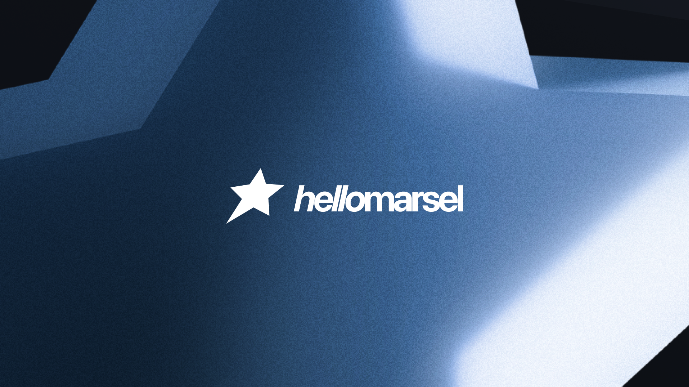

  

  # Hello, I'm Marsel! 👋 | Привет, я Марсель! 👋

  **Creative Developer & Designer specializing in high-end digital experiences.**
  **Креативный разработчик и дизайнер, специализирующийся на высококлассных цифровых продуктах.**

  [Telegram](https://t.me/marselspace) • [Behance](https://www.behance.net/hellomarsel) • [Dribbble](http://dribbble.com/hellomarsel) • [Instagram](https://www.instagram.com/hellomarsel/)

---

## 🇷🇺 Обо мне
Я создаю визуальные решения, которые достигают бизнес-целей и радуют пользователей. 
От логотипов и сложного брендинга до полноценных интерактивных веб-сайтов и UI/UX интерфейсов.

### Мой стек и инструменты:
- **Дизайн:** Figma, Adobe Creative Suite (Photoshop, Illustrator)
- **Фронтенд:** React, TypeScript, Tailwind CSS, Vite, Framer Motion
- **Бэкенд:** Node.js, Express, Firebase (Firestore)

### 💼 Мои услуги
1. **Graphic Design & Branding:** Логотипы, фирменный стиль, презентации и принты.
2. **Web Design & Interfaces:** Продающие лендинги, корпоративные сайты, UI/UX для мобильных и веб-приложений.
3. **Social Media & Graphics:** Оформление профилей соцсетей (Telegram, YouTube, VK), инфографика для маркетплейсов.

---

## 🇬🇧 About Me
I create visual solutions that achieve business goals and delight users. 
From logos and complex branding to fully interactive websites and UI/UX interfaces.

### My Stack & Tools:
- **Design:** Figma, Adobe Creative Suite (Photoshop, Illustrator)
- **Frontend:** React, TypeScript, Tailwind CSS, Vite, Framer Motion
- **Backend:** Node.js, Express, Firebase (Firestore)

### 💼 My Services
1. **Graphic Design & Branding:** Logos, corporate identity, presentations, and print materials.
2. **Web Design & Interfaces:** High-converting landing pages, corporate websites, UI/UX for mobile and web apps.
3. **Social Media & Graphics:** Social media profile design (Telegram, YouTube, VK), marketplace infographics.

---

## 🛠 О проекте / About the Project (Portfolio Codebase)
Этот репозиторий содержит исходный код моего личного сайта-портфолио. / This repository contains the source code of my personal portfolio website.
Сайт спроектирован с упором на эстетику, производительность и безопасность: / The site is designed with a focus on aesthetics, performance, and security:

- **Плавные анимации / Smooth Animations:** Использование библиотеки `motion/react` и кастомного скролла (Lenis). / Powered by `motion/react` and custom scroll (Lenis).
- **Многоязычность / Multilingual:** Нативная поддержка RU / EN. / Native RU / EN support.
- **Безопасная архитектура / Secure Architecture:** 
  - Backend on Express (`server.ts`).
  - Spam protection (Honeypot) & Rate Limiting.
  - Integration with **Telegram Bot API** for instant notifications.
  - Persistent lead storage in **Firebase Firestore** with robust Security Rules.

---

## 📬 Контакты / Contacts
Открыт к интересным проектам и сотрудничеству! Обсудить проект:
Open to interesting projects and collaborations! Let's discuss your project:

- ✉️ **Email:** [marselspace@gmail.com](mailto:marselspace@gmail.com)
- 💬 **Telegram:** [@marselspace](https://t.me/marselspace)
- 🎨 **Behance:** [hellomarsel](https://www.behance.net/hellomarsel)
- 🏀 **Dribbble:** [hellomarsel](http://dribbble.com/hellomarsel)
- 📸 **Instagram:** [@hellomarsel](https://www.instagram.com/hellomarsel/)
- 🐦 **Twitter / X:** [@Hellomarsel](https://x.com/Hellomarsel)
- 🧵 **Threads:** [@hellomarsel](https://www.threads.com/@hellomarsel)
- 🎵 **TikTok:** [@helllomarsel](https://www.tiktok.com/@helllomarsel)
- 📺 **YouTube:** [@HelloMarsel](https://www.youtube.com/@HelloMarsel)
